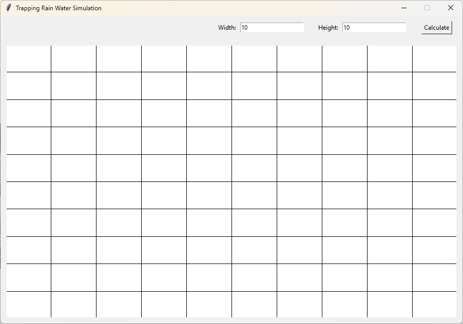
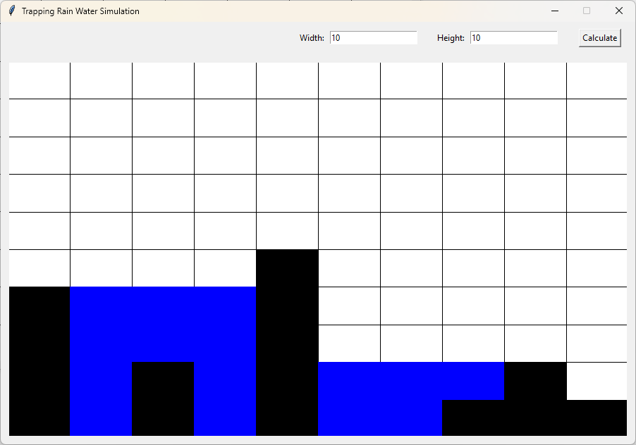
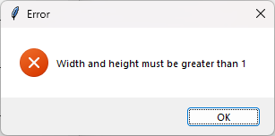
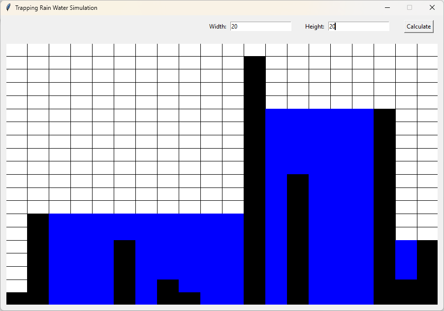

# Trapping water
## Why this project?
I wanted to create small simulation after I faced **Trapping Rain Water** challenge. 

## Usage
- Run *main.py*
- Set custom grid size
- Click on grid tile to set block height
- Click on end of block to delete him
- Water will generate automatically

## Screenshots
### Start view

### Generated water

### Form validation error

### Changed grid size
